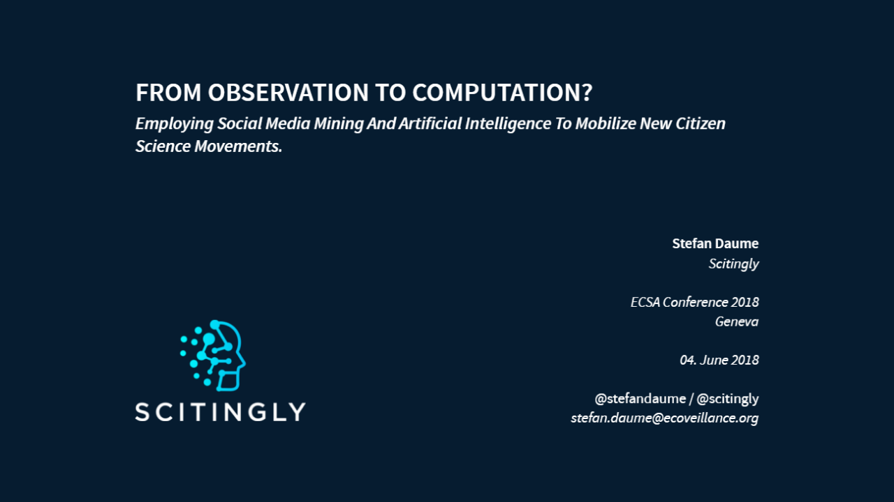

```{r setup, include=FALSE}
library(tufte)
# invalidate cache when the tufte version changes
knitr::opts_chunk$set(tidy = FALSE, cache.extra = packageVersion('tufte'))
options(htmltools.dir.version = FALSE)
```


```{r fig-margin-slide-1, out.width = "100%", fig.cap="These are handouts for a presentation due on 04. June 2018 at the [ECSA Conference 2018 in Geneva](https://www.ecsa-conference.eu/). The presentation will be available in [HTML](https://sdaume.github.io/2018-ECSA-Social-Computation) and [PDF](https://sdaume.github.io/2018-ECSA-Social-Computation); these handouts will also available as [HTML](https://sdaume.github.io/2018-ECSA-Social-Computation/handouts) and [PDF](https://sdaume.github.io/2018-ECSA-Social-Computation/handouts). The source for both will be available in this [GitHub repository](https://github.com/sdaume/2018-ECSA-Social-Computation/).", echo = FALSE}

```


# Abstract
Recruiting volunteers for citizen science projects will typically require significant resources to identify and communicate with potential contributors.  Social online media have proven be valuable sources for many types of data that might commonly be collected in citizen science projects. Examples include observations of species and environmental conditions, occurrences of invasive alien species or plant diseases.  
Moreover, the ad-hoc assembly of virtual communities has been observed which solve tasks such as species identifications by engaging in for example Twitter conversations. The term ‘embryonic citizen science communities’ [@DaumeGalaz2016_PLOSONE_11] has been used to describe virtual communities that – unaware of their implicit status as citizen scientists – solve tasks which correspond to crowdsourcing efforts employed in many traditional citizen science projects.   
In this speed talk I will outline a theoretical framework to identify and engage emergent virtual communities that provide citizen science-like contributions, in order to ultimately transform them into active citizen science movements, which may be able to contribute to research or deliver rapid responses to environmental challenges.


# Bio
Dr Stefan Daume is currently preparing to launch Scitingly^[https://scitingly.net], a social enterprise and open science platform which will be dedicated to mobilizing social media data and communities for environmental monitoring and citizen science.   
He holds degrees in Forest Sciences (University of Goettingen) and Artificial Intelligence (The University of Edinburgh). His PhD project (University of Goettingen) - completed in close collaboration with the Stockholm Resilience Centre - focused on social media mining as an opportunistic citizen science model in environmental monitoring.   
He previously worked in several IT startups, before concentrating on biodiversity informatics, crowdsourcing and citizen science with assignments at the Stockholm Resilience Centre, the Swedish node of the Global Biodiversity Information Facility and the Bioinformatics group at the Swedish Museum of Natural History.


# Credits
The **[knitr](https://github.com/yihui/knitr)** and the **[tufte](https://github.com/rstudio/tufte)** packages have been used to generate these presentation handouts. The former is released under a GPL2/GPL3 license, the latter under a GPL3 license.

