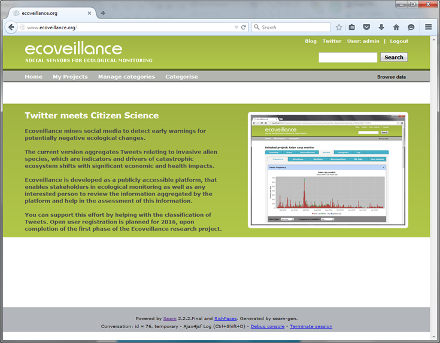

---
output:
  md_document:
    variant: markdown
---

```{r setup, include=FALSE}
knitr::opts_chunk$set(echo = FALSE)
```

[//]: <> (Alternative background colours are #002b36 #333 #1E8C45)


## &nbsp; {.hideslideheader data-background="#061C30"}
<div style="display:table;width:100%;table-layout: fixed;">
  <div class="title-without-logo" style="display:table-cell;width:100%;padding-right:3%;padding-left:3%;vertical-align:middle;">
  From observation to computation? 
  
  Employing social media mining and artificial intelligence to mobilize new citizen science movements.
    
  &nbsp;
    
  &nbsp;
  
  &nbsp;
  </div>
</div>

<div style="display:table;width:100%;table-layout: fixed;">
  <div class="mytitlepage linksection" style="display:table-cell;width:30%;padding-left:3%;vertical-align:bottom;">
  [](https://scitingly.net)
  </div>
  
  
  <div class="mytitlepage authorsection" style="display:table-cell;width:70%;padding-right:3%;">
  &nbsp;
  **Stefan Daume**
  
  *Scitingly*
  
  &nbsp;
  
  *ECSA Conference 2018*
  
  *Geneva*
  
  &nbsp;
  
  *04. June 2018*
  
  &nbsp;
  
  [\@stefandaume](https://twitter.com/stefandaume) / [\@scitingly](https://twitter.com/scitingly)
  
  *stefan.daume@ecoveillance.org*
  </div>
</div>


# Motivation

## Galaz et al paper {.hideslideheader}


<div class="attribution-dark">Frontiers in Ecology and the Environment 2009; 7, [doi:10.1890/070204](https://esajournals.onlinelibrary.wiley.com/doi/abs/10.1890/070204)</div>


## Catastrophic ecosystem changes {data-transition="none" .slideheader-light .left-aligned-slide data-background="./images/dead_fish_eutrophication.jpg"}

<div style="color: white;text-align: right;">**&nbsp;**</div>
<div style="color: white;text-align: right;">**&nbsp;**</div>
<div style="color: white;text-align: right;">**&nbsp;**</div>
<div style="color: white;text-align: right;">**&nbsp;**</div>

<div style="display:table;width:100%;margin-top:38%;table-layout:fixed;">
  <div class="attribution-light" style="display:table-cell;width:100%;vertical-align:bottom;">Photo credit: Dr. Jennifer L. Graham, U.S. Geological Survey, <a href="https://www.flickr.com/photos/48722974@N07/5120831376">Flickr</a>, <a href="https://creativecommons.org/licenses/by/2.0/">CC BY 2.0</a>
  </div>
</div>

<aside class="notes">
What is needed?
* Methods to obtain earlier warnings
* Information to adapt to progressing ecological change

Possible solutions:
* More resources for traditional monitoring programmes
* Citizen science as a supplemental monitoring source

But why not informal information sources?
<aside>


## Catastrophic ecosystem changes {data-transition="none" .slideheader-light .left-aligned-slide data-background="./images/dead_fish_eutrophication.jpg"}

<div style="color: white;text-align: right;">**&nbsp;**</div>
<div style="color: white;text-align: right;">**EARLIER WARNINGS THROUGH**</div>
<div style="color: white;text-align: right;">**OPPORTUNISTIC, INFORMAL**</div>
<div style="color: white;text-align: right;">**SOURCES?**</div>

<div style="display:table;width:100%;margin-top:38%;table-layout:fixed;">
  <div class="attribution-light" style="display:table-cell;width:100%;vertical-align:bottom;">Photo credit: Dr. Jennifer L. Graham, U.S. Geological Survey, <a href="https://www.flickr.com/photos/48722974@N07/5120831376">Flickr</a>, <a href="https://creativecommons.org/licenses/by/2.0/">CC BY 2.0</a>
  </div>
</div>


## Informal sources are already used in similar domains

## Epidemic disease monitoring {.top-aligned-slide data-background="./images/healthmap_org_screenshot_2018.jpg"}

<aside class="notes">
* examples: WHO GPHIN, Google Flu, specific projects (Dengue fever)
* similarities with ecological monitoring, but also differences
   * (not always discrete)
   * much broader scope
<aside>

   
# Framing the research

## Problem framing {.hideslideheader}

Which social media?

Which ecological problems?


## Social Media Landscape {.hideslideheader}
```{r  out.width = "55%"}
knitr::include_graphics('images/social_media_landscape_2017.jpeg') 
```
<div class="attribution-dark">Source: <a href="https://fredcavazza.net/2017/04/19/social-media-landscape-2017/">https://fredcavazza.net/2017/04/19/social-media-landscape-2017/</a>
</div>


## Choice: Twitter

<div style="display:table;width:100%;table-layout:fixed;vertical-align:center;">
  <div style="display:table-cell;width:100%;">
  
  </div>
</div>


## Choice: Invasive Alien Species {data-background="./images/asian_carp_by_nerissa_michaels.jpg"}

<div style="display:table;width:100%;margin-top:60%;table-layout:fixed;">
  <div class="attribution-light" style="display:table-cell;width:100%;vertical-align:bottom;">
  &copy; <a href="http://wwx.inhs.illinois.edu/fieldstations/irbs/">Nerissa Michaels, Illinois River Station</a>
  </div>
</div>

<aside class="notes">
* Drivers and indicators of ecosystem change 
* Ecological, economic and security significance
* Recognizable by non-experts
* Often notable and discrete events
* Subject of “traditional” ecological monitoring
</aside>


# Data collection

## Ecoveillance platform 

```{r  out.width = "65%"}
 
```

<aside class="notes">
* key purpose
* functions
</aside>


# So, what were the results?

## Sample Tweets

<blockquote class="twitter-tweet" data-lang="en" data-align="center"><p lang="en" dir="ltr">Please keep children and animals away from hairy caterpillars and their nests in oak trees. This will help avoid avoid itching skin rashes and other health problems caused by  oak processionary moth caterpillars. <a href="https://t.co/DFFY34h51D">https://t.co/DFFY34h51D</a> <a href="https://t.co/KiPpP3bSLr">pic.twitter.com/KiPpP3bSLr</a></p>&mdash; EalingCouncil (@EalingCouncil) <a href="https://twitter.com/EalingCouncil/status/997748807050956800?ref_src=twsrc%5Etfw">May 19, 2018</a></blockquote>
<script async src="https://platform.twitter.com/widgets.js" charset="utf-8"></script>


## Sample Tweets

<blockquote class="twitter-tweet" data-lang="en" data-width="280" data-align="center"><p lang="en" dir="ltr">First time I saw the oak processionary in action today. Quite impressive phenomenon! <a href="https://t.co/Lmo9s6LNqp">pic.twitter.com/Lmo9s6LNqp</a></p>&mdash; Home Turf Project (@HomeTurfProject) <a href="https://twitter.com/HomeTurfProject/status/997217867870408704?ref_src=twsrc%5Etfw">May 17, 2018</a></blockquote>
<script async src="https://platform.twitter.com/widgets.js" charset="utf-8"></script>


## Sample Tweets

<blockquote class="twitter-tweet" data-lang="en" data-align="center"><p lang="en" dir="ltr">How cute is this baby grey <a href="https://twitter.com/hashtag/squirrel?src=hash&amp;ref_src=twsrc%5Etfw">#squirrel</a> in <a href="https://twitter.com/ErddigNT?ref_src=twsrc%5Etfw">@ErddigNT</a> country park today also saw my first comma <a href="https://twitter.com/hashtag/butterfly?src=hash&amp;ref_src=twsrc%5Etfw">#butterfly</a> of the year and another speckled wood <a href="https://twitter.com/savebutterflies?ref_src=twsrc%5Etfw">@savebutterflies</a> <a href="https://twitter.com/Natures_Voice?ref_src=twsrc%5Etfw">@Natures_Voice</a> <a href="https://twitter.com/North_Wales_WT?ref_src=twsrc%5Etfw">@North_Wales_WT</a> <a href="https://twitter.com/LifeinNW?ref_src=twsrc%5Etfw">@LifeinNW</a> <a href="https://twitter.com/AMAZlNGNATURE?ref_src=twsrc%5Etfw">@AMAZlNGNATURE</a> <a href="https://t.co/r8p479WvDM">pic.twitter.com/r8p479WvDM</a></p>&mdash; Melissa Roberts (@smilingassasin) <a href="https://twitter.com/smilingassasin/status/997486503348527104?ref_src=twsrc%5Etfw">May 18, 2018</a></blockquote>
<script async src="https://platform.twitter.com/widgets.js" charset="utf-8"></script>


## Summary of results

* Tweets are a rich source of **primary biodiversity observations** in general ([Daume, 2016](https://www.sciencedirect.com/science/article/pii/S157495411500196X)).
* **Singular observations** of invasive species prove valuable.
* Distinctive **public perceptions** can be extracted.


# Mobilise communities not data!

## ECS example (step 1) {data-transition="none" .hideslideheader .top-aligned-slide}

<div style="display:table;width:100%;table-layout: fixed;">
  <div style="display:table-cell;width:50%;vertical-align:top;padding:1%;">
  <blockquote class="twitter-tweet" data-lang="en-gb" data-align="center"><p lang="en" dir="ltr">Saw this beautiful iridescent green bug today. Anyone know what it is? <a href="https://t.co/kTWt8rG594">https://t.co/kTWt8rG594</a></p>&mdash; Lindsey Kuper (@lindsey) <a href="https://twitter.com/lindsey/status/483808338015047680?ref_src=twsrc%5Etfw">1 July 2014</a></blockquote>
<script async src="https://platform.twitter.com/widgets.js" charset="utf-8"></script>
  </div>
  
  <div style="display:table-cell;width:50%;padding:1%;">
  </div>
</div>


## ECS example (step 2) {data-transition="none" .hideslideheader .top-aligned-slide}

<div style="display:table;width:100%;table-layout: fixed;">
  <div style="display:table-cell;width:50%;vertical-align:top;padding:1%;">
  <blockquote class="twitter-tweet" data-lang="en-gb" data-align="center"><p lang="en" dir="ltr">Saw this beautiful iridescent green bug today. Anyone know what it is? <a href="https://t.co/kTWt8rG594">https://t.co/kTWt8rG594</a></p>&mdash; Lindsey Kuper (@lindsey) <a href="https://twitter.com/lindsey/status/483808338015047680?ref_src=twsrc%5Etfw">1 July 2014</a></blockquote>
<script async src="https://platform.twitter.com/widgets.js" charset="utf-8"></script>
  </div>
  
  <div style="display:table-cell;width:50%;padding:1%;">
  <blockquote class="twitter-tweet" data-conversation="none" data-align="center" data-lang="en-gb"><p lang="en" dir="ltr"><a href="https://twitter.com/lindsey?ref_src=twsrc%5Etfw">@lindsey</a> no, but a google search-by-image might? Also, neat bug!</p>&mdash; Allison Kaptur (@akaptur) <a href="https://twitter.com/akaptur/status/483809094151987200?ref_src=twsrc%5Etfw">1 July 2014</a></blockquote>
<script async src="https://platform.twitter.com/widgets.js" charset="utf-8"></script>
  </div>
</div>


## ECS example (step 3) {data-transition="none" .hideslideheader .top-aligned-slide}

<div style="display:table;width:100%;table-layout: fixed;">
  <div style="display:table-cell;width:50%;vertical-align:top;padding:1%;">
  <blockquote class="twitter-tweet" data-lang="en-gb" data-align="center"><p lang="en" dir="ltr">Saw this beautiful iridescent green bug today. Anyone know what it is? <a href="https://t.co/kTWt8rG594">https://t.co/kTWt8rG594</a></p>&mdash; Lindsey Kuper (@lindsey) <a href="https://twitter.com/lindsey/status/483808338015047680?ref_src=twsrc%5Etfw">1 July 2014</a></blockquote>
<script async src="https://platform.twitter.com/widgets.js" charset="utf-8"></script>
  </div>
  
  <div style="display:table-cell;width:50%;padding:1%;">
  <blockquote class="twitter-tweet" data-lang="en-gb" data-align="center"><p lang="en" dir="ltr"><a href="https://twitter.com/akaptur?ref_src=twsrc%5Etfw">@akaptur</a> <a href="https://twitter.com/lindsey?ref_src=twsrc%5Etfw">@lindsey</a> That&#39;s a Tiger Beetle!</p>&mdash; Ben Britttain (@Brittain_Ben) <a href="https://twitter.com/Brittain_Ben/status/483812400835985408?ref_src=twsrc%5Etfw">1 July 2014</a></blockquote>
<script async src="https://platform.twitter.com/widgets.js" charset="utf-8"></script>
  </div>
</div>


## ECS example (step 4) {data-transition="none" .hideslideheader .top-aligned-slide}

<div style="display:table;width:100%;table-layout: fixed;">
  <div style="display:table-cell;width:50%;vertical-align:top;padding:1%;">
  <blockquote class="twitter-tweet" data-lang="en-gb" data-align="center"><p lang="en" dir="ltr">Saw this beautiful iridescent green bug today. Anyone know what it is? <a href="https://t.co/kTWt8rG594">https://t.co/kTWt8rG594</a></p>&mdash; Lindsey Kuper (@lindsey) <a href="https://twitter.com/lindsey/status/483808338015047680?ref_src=twsrc%5Etfw">1 July 2014</a></blockquote>
<script async src="https://platform.twitter.com/widgets.js" charset="utf-8"></script>
  </div>
  
  <div style="display:table-cell;width:50%;padding:1%;">
  <blockquote class="twitter-tweet" data-lang="en-gb" data-align="center"><p lang="en" dir="ltr"><a href="https://twitter.com/akaptur?ref_src=twsrc%5Etfw">@akaptur</a> <a href="https://twitter.com/lindsey?ref_src=twsrc%5Etfw">@lindsey</a> That&#39;s a Tiger Beetle!</p>&mdash; Ben Britttain (@Brittain_Ben) <a href="https://twitter.com/Brittain_Ben/status/483812400835985408?ref_src=twsrc%5Etfw">1 July 2014</a></blockquote>
<script async src="https://platform.twitter.com/widgets.js" charset="utf-8"></script>
<blockquote class="twitter-tweet" data-conversation="none" data-lang="en-gb"><p lang="en" dir="ltr"><a href="https://twitter.com/Brittain_Ben?ref_src=twsrc%5Etfw">@Brittain_Ben</a> <a href="https://twitter.com/akaptur?ref_src=twsrc%5Etfw">@akaptur</a> Thanks! <a href="https://twitter.com/ndr_qef?ref_src=twsrc%5Etfw">@ndr_qef</a> pointed me to <a href="http://t.co/Y4oOvAfzfQ">http://t.co/Y4oOvAfzfQ</a>, but I think my picture is prettier...</p>&mdash; Lindsey Kuper (@lindsey) <a href="https://twitter.com/lindsey/status/483814052192612352?ref_src=twsrc%5Etfw">1 July 2014</a></blockquote>
<script async src="https://platform.twitter.com/widgets.js" charset="utf-8"></script>
  </div>
</div>


## ECS example (step 5) {data-transition="none" .hideslideheader .top-aligned-slide}

<div style="display:table;width:100%;table-layout: fixed;">
  <div style="display:table-cell;width:50%;vertical-align:top;padding:1%;">
  <blockquote class="twitter-tweet" data-lang="en-gb" data-align="center"><p lang="en" dir="ltr">Saw this beautiful iridescent green bug today. Anyone know what it is? <a href="https://t.co/kTWt8rG594">https://t.co/kTWt8rG594</a></p>&mdash; Lindsey Kuper (@lindsey) <a href="https://twitter.com/lindsey/status/483808338015047680?ref_src=twsrc%5Etfw">1 July 2014</a></blockquote>
<script async src="https://platform.twitter.com/widgets.js" charset="utf-8"></script>
  </div>
  
  <div style="display:table-cell;width:50%;padding:1%;">
  <blockquote class="twitter-tweet" data-lang="en-gb" data-align="center" data-conversation="none"><p lang="en" dir="ltr"><a href="https://twitter.com/akaptur?ref_src=twsrc%5Etfw">@akaptur</a> <a href="https://twitter.com/lindsey?ref_src=twsrc%5Etfw">@lindsey</a> That&#39;s a Tiger Beetle!</p>&mdash; Ben Britttain (@Brittain_Ben) <a href="https://twitter.com/Brittain_Ben/status/483812400835985408?ref_src=twsrc%5Etfw">1 July 2014</a></blockquote>
<script async src="https://platform.twitter.com/widgets.js" charset="utf-8"></script>
<blockquote class="twitter-tweet" data-conversation="none" data-lang="en-gb"><p lang="en" dir="ltr"><a href="https://twitter.com/Brittain_Ben?ref_src=twsrc%5Etfw">@Brittain_Ben</a> <a href="https://twitter.com/akaptur?ref_src=twsrc%5Etfw">@akaptur</a> Thanks! <a href="https://twitter.com/ndr_qef?ref_src=twsrc%5Etfw">@ndr_qef</a> pointed me to <a href="http://t.co/Y4oOvAfzfQ">http://t.co/Y4oOvAfzfQ</a>, but I think my picture is prettier...</p>&mdash; Lindsey Kuper (@lindsey) <a href="https://twitter.com/lindsey/status/483814052192612352?ref_src=twsrc%5Etfw">1 July 2014</a></blockquote>
<script async src="https://platform.twitter.com/widgets.js" charset="utf-8"></script>
<blockquote class="twitter-tweet" data-conversation="none" data-lang="en-gb"><p lang="en" dir="ltr"><a href="https://twitter.com/lindsey?ref_src=twsrc%5Etfw">@lindsey</a> <a href="https://twitter.com/akaptur?ref_src=twsrc%5Etfw">@akaptur</a> <a href="https://twitter.com/ndr_qef?ref_src=twsrc%5Etfw">@ndr_qef</a> I&#39;m gonna argue it is a Cicindela sexguttata. <a href="http://t.co/otbd4cKjJW">http://t.co/otbd4cKjJW</a> :D</p>&mdash; Ben Britttain (@Brittain_Ben) <a href="https://twitter.com/Brittain_Ben/status/483817129917956098?ref_src=twsrc%5Etfw">1 July 2014</a></blockquote>
<script async src="https://platform.twitter.com/widgets.js" charset="utf-8"></script>
  </div>
</div>


## ECS example (step 6) {data-transition="none" .hideslideheader .top-aligned-slide}

<div style="display:table;width:100%;table-layout: fixed;">
  <div style="display:table-cell;width:50%;vertical-align:top;padding:1%;">
  <blockquote class="twitter-tweet" data-lang="en-gb" data-align="center"><p lang="en" dir="ltr">Saw this beautiful iridescent green bug today. Anyone know what it is? <a href="https://t.co/kTWt8rG594">https://t.co/kTWt8rG594</a></p>&mdash; Lindsey Kuper (@lindsey) <a href="https://twitter.com/lindsey/status/483808338015047680?ref_src=twsrc%5Etfw">1 July 2014</a></blockquote>
<script async src="https://platform.twitter.com/widgets.js" charset="utf-8"></script>
  </div>
  
  <div style="display:table-cell;width:50%;padding:1%;">
<blockquote class="twitter-tweet" data-conversation="none" data-lang="en-gb"><p lang="en" dir="ltr"><a href="https://twitter.com/Brittain_Ben?ref_src=twsrc%5Etfw">@Brittain_Ben</a> <a href="https://twitter.com/akaptur?ref_src=twsrc%5Etfw">@akaptur</a> Thanks! <a href="https://twitter.com/ndr_qef?ref_src=twsrc%5Etfw">@ndr_qef</a> pointed me to <a href="http://t.co/Y4oOvAfzfQ">http://t.co/Y4oOvAfzfQ</a>, but I think my picture is prettier...</p>&mdash; Lindsey Kuper (@lindsey) <a href="https://twitter.com/lindsey/status/483814052192612352?ref_src=twsrc%5Etfw">1 July 2014</a></blockquote>
<script async src="https://platform.twitter.com/widgets.js" charset="utf-8"></script>
<blockquote class="twitter-tweet" data-conversation="none" data-lang="en-gb"><p lang="en" dir="ltr"><a href="https://twitter.com/lindsey?ref_src=twsrc%5Etfw">@lindsey</a> <a href="https://twitter.com/akaptur?ref_src=twsrc%5Etfw">@akaptur</a> <a href="https://twitter.com/ndr_qef?ref_src=twsrc%5Etfw">@ndr_qef</a> I&#39;m gonna argue it is a Cicindela sexguttata. <a href="http://t.co/otbd4cKjJW">http://t.co/otbd4cKjJW</a> :D</p>&mdash; Ben Britttain (@Brittain_Ben) <a href="https://twitter.com/Brittain_Ben/status/483817129917956098?ref_src=twsrc%5Etfw">1 July 2014</a></blockquote>
<script async src="https://platform.twitter.com/widgets.js" charset="utf-8"></script>
<blockquote class="twitter-tweet" data-conversation="none" data-lang="en-gb"><p lang="en" dir="ltr"><a href="https://twitter.com/Brittain_Ben?ref_src=twsrc%5Etfw">@Brittain_Ben</a> <a href="https://twitter.com/akaptur?ref_src=twsrc%5Etfw">@akaptur</a> <a href="https://twitter.com/ndr_qef?ref_src=twsrc%5Etfw">@ndr_qef</a> Ooh, I think that&#39;s it! Thanks!</p>&mdash; Lindsey Kuper (@lindsey) <a href="https://twitter.com/lindsey/status/483817761680801792?ref_src=twsrc%5Etfw">1 July 2014</a></blockquote>
<script async src="https://platform.twitter.com/widgets.js" charset="utf-8"></script>
  </div>
</div>


## ECS example (step 7) {data-transition="none" .hideslideheader .top-aligned-slide}

<div style="display:table;width:100%;table-layout: fixed;">
  <div style="display:table-cell;width:50%;vertical-align:top;padding:1%;">
  <blockquote class="twitter-tweet" data-lang="en-gb" data-align="center"><p lang="en" dir="ltr">Saw this beautiful iridescent green bug today. Anyone know what it is? <a href="https://t.co/kTWt8rG594">https://t.co/kTWt8rG594</a></p>&mdash; Lindsey Kuper (@lindsey) <a href="https://twitter.com/lindsey/status/483808338015047680?ref_src=twsrc%5Etfw">1 July 2014</a></blockquote>
<script async src="https://platform.twitter.com/widgets.js" charset="utf-8"></script>
  </div>
  
  <div style="display:table-cell;width:50%;padding:1%;">
<blockquote class="twitter-tweet" data-conversation="none" data-lang="en-gb"><p lang="en" dir="ltr"><a href="https://twitter.com/lindsey?ref_src=twsrc%5Etfw">@lindsey</a> <a href="https://twitter.com/akaptur?ref_src=twsrc%5Etfw">@akaptur</a> <a href="https://twitter.com/ndr_qef?ref_src=twsrc%5Etfw">@ndr_qef</a> I&#39;m gonna argue it is a Cicindela sexguttata. <a href="http://t.co/otbd4cKjJW">http://t.co/otbd4cKjJW</a> :D</p>&mdash; Ben Britttain (@Brittain_Ben) <a href="https://twitter.com/Brittain_Ben/status/483817129917956098?ref_src=twsrc%5Etfw">1 July 2014</a></blockquote>
<script async src="https://platform.twitter.com/widgets.js" charset="utf-8"></script>
<blockquote class="twitter-tweet" data-conversation="none" data-lang="en-gb"><p lang="en" dir="ltr"><a href="https://twitter.com/Brittain_Ben?ref_src=twsrc%5Etfw">@Brittain_Ben</a> <a href="https://twitter.com/akaptur?ref_src=twsrc%5Etfw">@akaptur</a> <a href="https://twitter.com/ndr_qef?ref_src=twsrc%5Etfw">@ndr_qef</a> Ooh, I think that&#39;s it! Thanks!</p>&mdash; Lindsey Kuper (@lindsey) <a href="https://twitter.com/lindsey/status/483817761680801792?ref_src=twsrc%5Etfw">1 July 2014</a></blockquote>
<script async src="https://platform.twitter.com/widgets.js" charset="utf-8"></script>
<blockquote class="twitter-tweet" data-conversation="none" data-lang="en-gb"><p lang="en" dir="ltr"><a href="https://twitter.com/lindsey?ref_src=twsrc%5Etfw">@lindsey</a> <a href="https://twitter.com/Brittain_Ben?ref_src=twsrc%5Etfw">@Brittain_Ben</a> <a href="https://twitter.com/akaptur?ref_src=twsrc%5Etfw">@akaptur</a> Indeed. (Number of spots not actually guaranteed; your critter happens to sport eight spots.)</p>&mdash; Andrew (@ndr_qef) <a href="https://twitter.com/ndr_qef/status/483820359775703040?ref_src=twsrc%5Etfw">1 July 2014</a></blockquote>
<script async src="https://platform.twitter.com/widgets.js" charset="utf-8"></script>
  </div>
</div>


## ECS example (step 8) {data-transition="none" .hideslideheader .top-aligned-slide}

<div style="display:table;width:100%;table-layout: fixed;">
  <div style="display:table-cell;width:50%;vertical-align:top;padding:1%;">
  <blockquote class="twitter-tweet" data-lang="en-gb" data-align="center"><p lang="en" dir="ltr">Saw this beautiful iridescent green bug today. Anyone know what it is? <a href="https://t.co/kTWt8rG594">https://t.co/kTWt8rG594</a></p>&mdash; Lindsey Kuper (@lindsey) <a href="https://twitter.com/lindsey/status/483808338015047680?ref_src=twsrc%5Etfw">1 July 2014</a></blockquote>
<script async src="https://platform.twitter.com/widgets.js" charset="utf-8"></script>
  </div>
  
  <div style="display:table-cell;width:50%;padding:1%;">
<blockquote class="twitter-tweet" data-conversation="none" data-lang="en-gb"><p lang="en" dir="ltr"><a href="https://twitter.com/Brittain_Ben?ref_src=twsrc%5Etfw">@Brittain_Ben</a> <a href="https://twitter.com/akaptur?ref_src=twsrc%5Etfw">@akaptur</a> <a href="https://twitter.com/ndr_qef?ref_src=twsrc%5Etfw">@ndr_qef</a> Ooh, I think that&#39;s it! Thanks!</p>&mdash; Lindsey Kuper (@lindsey) <a href="https://twitter.com/lindsey/status/483817761680801792?ref_src=twsrc%5Etfw">1 July 2014</a></blockquote>
<script async src="https://platform.twitter.com/widgets.js" charset="utf-8"></script>
<blockquote class="twitter-tweet" data-conversation="none" data-lang="en-gb"><p lang="en" dir="ltr"><a href="https://twitter.com/lindsey?ref_src=twsrc%5Etfw">@lindsey</a> <a href="https://twitter.com/Brittain_Ben?ref_src=twsrc%5Etfw">@Brittain_Ben</a> <a href="https://twitter.com/akaptur?ref_src=twsrc%5Etfw">@akaptur</a> Indeed. (Number of spots not actually guaranteed; your critter happens to sport eight spots.)</p>&mdash; Andrew (@ndr_qef) <a href="https://twitter.com/ndr_qef/status/483820359775703040?ref_src=twsrc%5Etfw">1 July 2014</a></blockquote>
<script async src="https://platform.twitter.com/widgets.js" charset="utf-8"></script>
<blockquote class="twitter-tweet" data-conversation="none" data-lang="en-gb"><p lang="en" dir="ltr"><a href="https://twitter.com/ndr_qef?ref_src=twsrc%5Etfw">@ndr_qef</a> <a href="https://twitter.com/Brittain_Ben?ref_src=twsrc%5Etfw">@Brittain_Ben</a> <a href="https://twitter.com/akaptur?ref_src=twsrc%5Etfw">@akaptur</a> Here&#39;s another with eight! <a href="http://t.co/hIWDoDdSh9">http://t.co/hIWDoDdSh9</a> Article edited: <a href="https://t.co/hfgbV8EeiC">https://t.co/hfgbV8EeiC</a> \o/</p>&mdash; Lindsey Kuper (@lindsey) <a href="https://twitter.com/lindsey/status/483828472666542080?ref_src=twsrc%5Etfw">1 July 2014</a></blockquote>
<script async src="https://platform.twitter.com/widgets.js" charset="utf-8"></script>
  </div>
</div>


## "Embryonic Citizen Science Communities" {.hideslideheader} 

* These Twitter conversations are [**embryonic citizen science communities**](http://journals.plos.org/plosone/article?id=10.1371/journal.pone.0151387) (Daume & Galaz, 2016).

>* Biodiversity data is **collected**, **shared**, **reviewed**, **verified** and **annotated**.
>* And than **forgotten**.


## Socially computed data of high quality


## Formalisation of interactions is required


<aside class="notes">
Hence the collaboration with Edinburgh Informatics.
</aside>


## Automatic annotation and evaluation of social computations

* Express these interactions with a [**social calculus**](https://eprints.soton.ac.uk/371943/) (Robertson et al, 2014).
* Automate the discovery and formal representation of these conversations.
  
<aside class="notes">
  * formalise generic calculus for verifying environmental observations
  * automate the discovery and annotation of this information
</aside>


## How can this be applied?

* To assess the reliability of environmental observations sourced from Twitter.
* To compare with and assess other environmental data sources. 
* To provide seed data and communities for specific projects.

<aside class="notes">
* can be applied to classic citsci platform patterns and other data sources; and thus helps to compare data sources
* seed data and community for targeted projects (if user profiles are also formalised)
</aside>


## Ecoveillance Application Scenario

1. Seed observation data 
2. Find micro-communities
3. Store observation data and alert original community
4. Invite community for **digital** curation of new data
5. Invite community for **"analog"** data collection

<aside class="notes">
* monitoring projects (examples currently explored: bumblebee, urban health, IAS, restoration)
* relate to planned Ecoveillance platform
</aside>


# Promising?

## Planned structure
<div style="display:table;width:100%;table-layout:fixed;vertical-align:center;">
  <div style="display:table-cell;width:50%;font-size: 1.2em;">
  **scitingly.io**
  </div>
  
  <div style="display:table-cell;width:50%;vertical-align:middle;font-size: 1.2em;">
  **"Scitingly Labs"**
  </div>
</div>

&nbsp;

```{r  out.width = "35%"}
 
```

<div style="display:table;width:100%;table-layout:fixed;vertical-align:center;font-size: 1.2em;">
  **Ecoveillance platform**
</div>


# Thank you!


## Colophon {.colophon}
**"From observation to computation? - Employing social media mining and artificial intelligence to mobilize new citizen science movements."** by *Stefan Daume*

&nbsp;

Presented at [ECSA Conference 2018](https://www.ecsa-conference.eu/) on 04. June 2018.

&nbsp;

This presentation can be cited using: *doi:...*

&nbsp;

**PRESENTATION DETAILS**

**Author/Affiliation:** Stefan Daume, Scitingly

**Presentation URL:** https://sdaume.github.io/2018-ECSA-Social-Computation

**Presentation Handouts:** https://sdaume.github.io/2018-ECSA-Social-Computation/handouts

**Presentation Source:** [TBD]

**Presentation PDF:** [TBD]

&nbsp;

**CREDITS & LICENSES**

This presentation is delivered with the help of several free and open source tools and libraries. It utilises the [reveal.js](https://revealjs.com/) presentation framework and has been created using [RMarkdown](https://rmarkdown.rstudio.com), [knitr](https://yihui.name/knitr/), [RStudio](https://www.rstudio.com) and [Pandoc](https://pandoc.org/). [highlight.js](https://highlightjs.org) provides syntax highlighting for code sections. PDF and JPG copies of this presentation were generated with [DeckTape](https://github.com/astefanutti/decktape). Please note the respective licenses of these tools and libraries.

&nbsp;

If not noted and attributed otherwise, the contents (text, charts, images) of this presentation are **Copyright &copy; 2018 of the Author** and provided under a *CC BY 4.0* public domain license. 


# Appendix

## What is needed?

* Methods to obtain earlier warnings
* Information to adapt to progressing ecological change


# Possible solutions

## More resources

For traditional environmental monitoring programmes.


## Citizen science

As a supplemental environmental information source. 


## Shocks {.slideheader-light data-background="./images/rim_fire_2013.jpg"}

<div style="display:table;width:100%;margin-top:65%;table-layout:fixed;">
  <div class="attribution-light" style="display:table-cell;width:100%;vertical-align:bottom;">
  U.S. Department of Agriculture, <a href="https://www.flickr.com/photos/41284017@N08/9599182665">Flickr 20130817-FS-UNK-0004</a>, <a href="https://creativecommons.org/licenses/by/2.0/">CC BY 2.0</a>
  </div>
</div>


## Twitter properties

<div style="display:table;width:100%;table-layout:fixed;vertical-align:center;">
  <div style="display:table-cell;width:50%;">
  
  </div>
  
  <div style="display:table-cell;width:50%;vertical-align:middle;">
  <ul>
    <li>Public</li>
    <li>Non-reciprocal</li>
    <li>Information-push network</li>
    <li>Real-time</li>
    <li>Low contribution hurdle</li>
    <li>Open API</li>
    <li>Large volume</li>
  </ul>
  </div>
</div>


## Ecological monitoring

* Broad spectrum of monitoring targets
* Not only discrete events
* Direct and indirect effects


## Sample species

<div style="display:table;width:100%;table-layout:fixed;vertical-align:center;">
  <div style="display:table-cell;width:33%;">
  Eastern grey squirrel
  
  <div class="attribution-dark" style="position:relative"><a href="https://commons.wikimedia.org/wiki/File:Eastern_Grey_Squirrel.jpg">Wikimedia</a>, 
  <a href="https://commons.wikimedia.org/wiki/User:Tomfriedel">Birdphotos.com</a>, <a href="https://creativecommons.org/licenses/by/3.0/deed.en">CC BY 3.0</a>
</div>
  </div>
  <div style="display:table-cell;width:33%;">
  Oak processionary
  
  <div class="attribution-dark" style="position:relative"><a href="https://commons.wikimedia.org/wiki/File:Thaumetopoea_processionea,_closeup.JPG">Wikimedia</a>, 
  <a href="https://commons.wikimedia.org/wiki/User:Kleuske">Kleuske</a>, <a href="https://creativecommons.org/licenses/by-sa/3.0/deed.en">CC BY-SA 3.0</a>
</div>
  </div>
  <div style="display:table-cell;width:33%;">
  Emerald ash borer
  
  <div class="attribution-dark" style="position:relative"><a href="https://commons.wikimedia.org/wiki/File:Adult_Emerald_Ash_Borer_on_a_penny.jpg">Wikimedia</a>, 
  <a href="http://www.na.fs.fed.us/spfo/eab/img/img.htm">Forest Service, USDA</a>
</div>
  </div>
</div>


## Limitations

* Tweets with exact geo-coordinates are rare.
* Only "interesting" species are tweet-worthy.


## High accuracy
76% correctly determined taxa, most at species level.

```{r  out.width = "75%"}
 
```
<div class="attribution-dark"><a href="https://doi.org/10.1371/journal.pone.0151387">Daume S, Galaz, 2016. PLoS ONE 11(3): e0151387. </a>
</div>


## Amateur-driven

```{r  out.width = "100%"}
 
```
<div class="attribution-dark"><a href="https://doi.org/10.1371/journal.pone.0151387">Daume S, Galaz, 2016. PLoS ONE 11(3): e0151387. </a>
</div>


## Next: signature projects

* Virtual Bumblebee Index
* **IUCN**: Invasive species monitoring for species prioritised by the EU
* **World Resources Institute**: community driven restoration of degraded forest

<aside class="notes">
(indicator species)
</aside>


