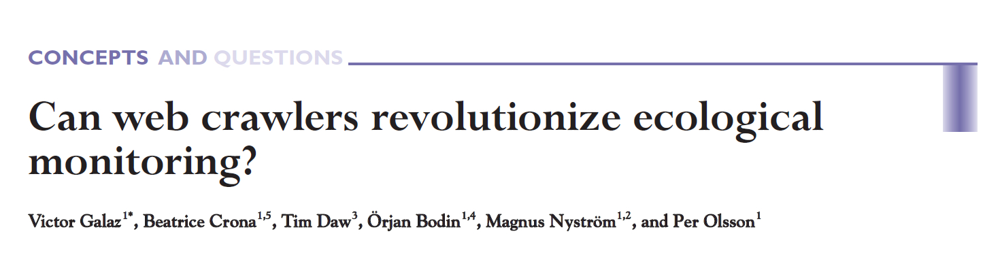
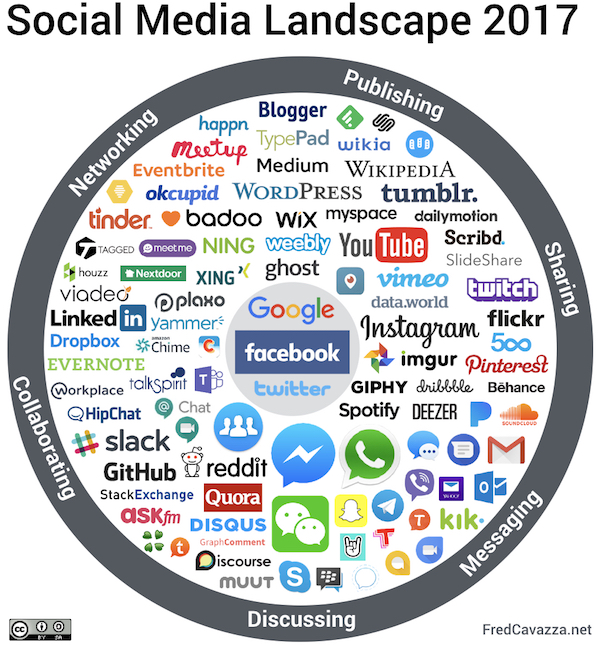
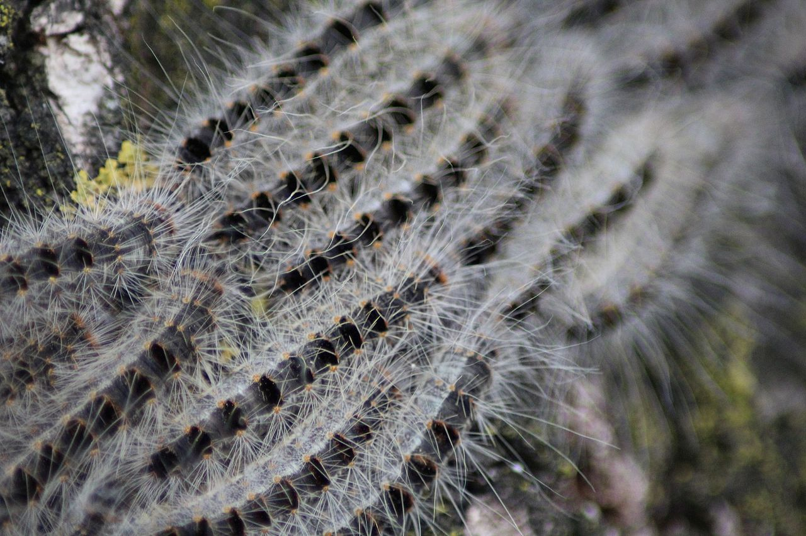

  {#section .hideslideheader data-background="#061C30"}
-

::: {style="display:table;width:100%;table-layout: fixed;"}
::: {.title-without-logo style="display:table-cell;width:100%;padding-right:3%;padding-left:3%;vertical-align:middle;"}
From observation to computation?

Employing social media mining and artificial intelligence to mobilize
new citizen science movements.

 

 

 
:::
:::

::: {style="display:table;width:100%;table-layout: fixed;"}
::: {.mytitlepage .linksection style="display:table-cell;width:30%;padding-left:3%;vertical-align:bottom;"}

:::

::: {.mytitlepage .authorsection style="display:table-cell;width:70%;padding-right:3%;"}
  **Stefan Daume**

*Scitingly*

 

*ECSA Conference 2018*

*Geneva*

 

*04. June 2018*

 

[\@stefandaume](https://twitter.com/stefandaume) /
[\@scitingly](https://twitter.com/scitingly)

*<stefan.daume@ecoveillance.org>*
:::
:::

Motivation
==========

Galaz et al paper {#galaz-et-al-paper .hideslideheader}
-----------------

::: {.attribution-dark}
Frontiers in Ecology and the Environment 2009; 7,
[doi:10.1890/070204](https://esajournals.onlinelibrary.wiley.com/doi/abs/10.1890/070204)
:::

Catastrophic ecosystem changes {#catastrophic-ecosystem-changes .slideheader-light .left-aligned-slide data-transition="none" data-background="./images/dead_fish_eutrophication.jpg"}
------------------------------

::: {style="color: white;text-align: right;"}
** **
:::

::: {style="color: white;text-align: right;"}
** **
:::

::: {style="color: white;text-align: right;"}
** **
:::

::: {style="color: white;text-align: right;"}
** **
:::

::: {style="display:table;width:100%;margin-top:38%;table-layout:fixed;"}
::: {.attribution-light style="display:table-cell;width:100%;vertical-align:bottom;"}
Photo credit: Dr. Jennifer L. Graham, U.S. Geological Survey,
<a href="https://www.flickr.com/photos/48722974@N07/5120831376">Flickr</a>,
<a href="https://creativecommons.org/licenses/by/2.0/">CC BY 2.0</a>
:::
:::

<aside class="notes">
What is needed? \* Methods to obtain earlier warnings \* Information to
adapt to progressing ecological change

Possible solutions: \* More resources for traditional monitoring
programmes \* Citizen science as a supplemental monitoring source

But why not informal information sources?
<aside>
Catastrophic ecosystem changes {#catastrophic-ecosystem-changes-1 .slideheader-light .left-aligned-slide data-transition="none" data-background="./images/dead_fish_eutrophication.jpg"}
------------------------------

::: {style="color: white;text-align: right;"}
** **
:::

::: {style="color: white;text-align: right;"}
**EARLIER WARNINGS THROUGH**
:::

::: {style="color: white;text-align: right;"}
**OPPORTUNISTIC, INFORMAL**
:::

::: {style="color: white;text-align: right;"}
**SOURCES?**
:::

::: {style="display:table;width:100%;margin-top:38%;table-layout:fixed;"}
::: {.attribution-light style="display:table-cell;width:100%;vertical-align:bottom;"}
Photo credit: Dr. Jennifer L. Graham, U.S. Geological Survey,
<a href="https://www.flickr.com/photos/48722974@N07/5120831376">Flickr</a>,
<a href="https://creativecommons.org/licenses/by/2.0/">CC BY 2.0</a>
:::
:::

Informal sources are already used in similar domains
----------------------------------------------------

Epidemic disease monitoring {#epidemic-disease-monitoring .top-aligned-slide data-background="./images/healthmap_org_screenshot_2018.jpg"}
---------------------------

<aside class="notes">
-   examples: WHO GPHIN, Google Flu, specific projects (Dengue fever)
-   similarities with ecological monitoring, but also differences
    -   (not always discrete)
    -   much broader scope
        <aside>

Framing the research
====================

Problem framing {#problem-framing .hideslideheader}
---------------

Which social media?

Which ecological problems?

Choice: Twitter
---------------

::: {style="display:table;width:100%;table-layout:fixed;vertical-align:center;"}
::: {style="display:table-cell;width:100%;"}

:::
:::

<aside class="notes">
-   Public
-   Non-reciprocal
-   Information-push network
-   Real-time
-   Low contribution hurdle
-   Open API
-   Large volume

</aside>
Choice: Invasive Alien Species {#choice-invasive-alien-species data-background="./images/asian_carp_by_nerissa_michaels.jpg"}
------------------------------

::: {style="display:table;width:100%;margin-top:60%;table-layout:fixed;"}
::: {.attribution-light style="display:table-cell;width:100%;vertical-align:bottom;"}
© <a href="http://wwx.inhs.illinois.edu/fieldstations/irbs/">Nerissa
Michaels, Illinois River Station</a>
:::
:::

<aside class="notes">
-   Drivers and indicators of ecosystem change
-   Ecological, economic and security significance
-   Recognizable by non-experts
-   Often notable and discrete events
-   Subject of "traditional" ecological monitoring

</aside>
Data collection
===============

Ecoveillance platform
---------------------

<aside class="notes">
-   key purpose
-   functions

</aside>
So, what were the results?
==========================

Sample Tweets
-------------

<blockquote class="twitter-tweet" data-lang="en" data-align="center">

Please keep children and animals away from hairy caterpillars and their
nests in oak trees. This will help avoid avoid itching skin rashes and
other health problems caused by oak processionary moth caterpillars.
<a href="https://t.co/DFFY34h51D">https://t.co/DFFY34h51D</a>
<a href="https://t.co/KiPpP3bSLr">pic.twitter.com/KiPpP3bSLr</a>

--- EalingCouncil (@EalingCouncil)
<a href="https://twitter.com/EalingCouncil/status/997748807050956800?ref_src=twsrc%5Etfw">May
19, 2018</a>
</blockquote>

Sample Tweets
-------------

<blockquote class="twitter-tweet" data-lang="en" data-width="280" data-align="center">

First time I saw the oak processionary in action today. Quite impressive
phenomenon!
<a href="https://t.co/Lmo9s6LNqp">pic.twitter.com/Lmo9s6LNqp</a>

--- Home Turf Project (@HomeTurfProject)
<a href="https://twitter.com/HomeTurfProject/status/997217867870408704?ref_src=twsrc%5Etfw">May
17, 2018</a>
</blockquote>

Sample Tweets
-------------

<blockquote class="twitter-tweet" data-lang="en" data-align="center">

How cute is this baby grey
<a href="https://twitter.com/hashtag/squirrel?src=hash&amp;ref_src=twsrc%5Etfw">\#squirrel</a>
in
<a href="https://twitter.com/ErddigNT?ref_src=twsrc%5Etfw">@ErddigNT</a>
country park today also saw my first comma
<a href="https://twitter.com/hashtag/butterfly?src=hash&amp;ref_src=twsrc%5Etfw">\#butterfly</a>
of the year and another speckled wood
<a href="https://twitter.com/savebutterflies?ref_src=twsrc%5Etfw">@savebutterflies</a>
<a href="https://twitter.com/Natures_Voice?ref_src=twsrc%5Etfw">@Natures_Voice</a>
<a href="https://twitter.com/North_Wales_WT?ref_src=twsrc%5Etfw">@North_Wales_WT</a>
<a href="https://twitter.com/LifeinNW?ref_src=twsrc%5Etfw">@LifeinNW</a>
<a href="https://twitter.com/AMAZlNGNATURE?ref_src=twsrc%5Etfw">@AMAZlNGNATURE</a>
<a href="https://t.co/r8p479WvDM">pic.twitter.com/r8p479WvDM</a>

--- Melissa Roberts (@smilingassasin)
<a href="https://twitter.com/smilingassasin/status/997486503348527104?ref_src=twsrc%5Etfw">May
18, 2018</a>
</blockquote>

Summary of results
------------------

-   Tweets are a rich source of **primary biodiversity observations** in
    general ([Daume,
    2016](https://www.sciencedirect.com/science/article/pii/S157495411500196X)).
-   **Singular observations** of invasive species prove valuable.
-   Distinctive **public perceptions** can be extracted.

Mobilise communities not data!
==============================

ECS example (step 1) {#ecs-example-step-1 .hideslideheader .top-aligned-slide data-transition="none"}
--------------------

::: {style="display:table;width:100%;table-layout: fixed;"}
::: {style="display:table-cell;width:50%;vertical-align:top;padding:1%;"}
<blockquote class="twitter-tweet" data-lang="en-gb" data-align="center">

Saw this beautiful iridescent green bug today. Anyone know what it is?
<a href="https://t.co/kTWt8rG594">https://t.co/kTWt8rG594</a>

--- Lindsey Kuper (@lindsey)
<a href="https://twitter.com/lindsey/status/483808338015047680?ref_src=twsrc%5Etfw">1
July 2014</a>
</blockquote>

:::

::: {style="display:table-cell;width:50%;padding:1%;"}
:::
:::

ECS example (step 2) {#ecs-example-step-2 .hideslideheader .top-aligned-slide data-transition="none"}
--------------------

::: {style="display:table;width:100%;table-layout: fixed;"}
::: {style="display:table-cell;width:50%;vertical-align:top;padding:1%;"}
<blockquote class="twitter-tweet" data-lang="en-gb" data-align="center">

Saw this beautiful iridescent green bug today. Anyone know what it is?
<a href="https://t.co/kTWt8rG594">https://t.co/kTWt8rG594</a>

--- Lindsey Kuper (@lindsey)
<a href="https://twitter.com/lindsey/status/483808338015047680?ref_src=twsrc%5Etfw">1
July 2014</a>
</blockquote>

:::

::: {style="display:table-cell;width:50%;padding:1%;"}
<blockquote class="twitter-tweet" data-conversation="none" data-align="center" data-lang="en-gb">

<a href="https://twitter.com/lindsey?ref_src=twsrc%5Etfw">@lindsey</a>
no, but a google search-by-image might? Also, neat bug!

--- Allison Kaptur (@akaptur)
<a href="https://twitter.com/akaptur/status/483809094151987200?ref_src=twsrc%5Etfw">1
July 2014</a>
</blockquote>

:::
:::

ECS example (step 3) {#ecs-example-step-3 .hideslideheader .top-aligned-slide data-transition="none"}
--------------------

::: {style="display:table;width:100%;table-layout: fixed;"}
::: {style="display:table-cell;width:50%;vertical-align:top;padding:1%;"}
<blockquote class="twitter-tweet" data-lang="en-gb" data-align="center">

Saw this beautiful iridescent green bug today. Anyone know what it is?
<a href="https://t.co/kTWt8rG594">https://t.co/kTWt8rG594</a>

--- Lindsey Kuper (@lindsey)
<a href="https://twitter.com/lindsey/status/483808338015047680?ref_src=twsrc%5Etfw">1
July 2014</a>
</blockquote>

:::

::: {style="display:table-cell;width:50%;padding:1%;"}
<blockquote class="twitter-tweet" data-lang="en-gb" data-align="center">

<a href="https://twitter.com/akaptur?ref_src=twsrc%5Etfw">@akaptur</a>
<a href="https://twitter.com/lindsey?ref_src=twsrc%5Etfw">@lindsey</a>
That\'s a Tiger Beetle!

--- Ben Britttain (@Brittain_Ben)
<a href="https://twitter.com/Brittain_Ben/status/483812400835985408?ref_src=twsrc%5Etfw">1
July 2014</a>
</blockquote>

:::
:::

ECS example (step 4) {#ecs-example-step-4 .hideslideheader .top-aligned-slide data-transition="none"}
--------------------

::: {style="display:table;width:100%;table-layout: fixed;"}
::: {style="display:table-cell;width:50%;vertical-align:top;padding:1%;"}
<blockquote class="twitter-tweet" data-lang="en-gb" data-align="center">

Saw this beautiful iridescent green bug today. Anyone know what it is?
<a href="https://t.co/kTWt8rG594">https://t.co/kTWt8rG594</a>

--- Lindsey Kuper (@lindsey)
<a href="https://twitter.com/lindsey/status/483808338015047680?ref_src=twsrc%5Etfw">1
July 2014</a>
</blockquote>

:::

::: {style="display:table-cell;width:50%;padding:1%;"}
<blockquote class="twitter-tweet" data-lang="en-gb" data-align="center">

<a href="https://twitter.com/akaptur?ref_src=twsrc%5Etfw">@akaptur</a>
<a href="https://twitter.com/lindsey?ref_src=twsrc%5Etfw">@lindsey</a>
That\'s a Tiger Beetle!

--- Ben Britttain (@Brittain_Ben)
<a href="https://twitter.com/Brittain_Ben/status/483812400835985408?ref_src=twsrc%5Etfw">1
July 2014</a>
</blockquote>

<blockquote class="twitter-tweet" data-conversation="none" data-lang="en-gb">

<a href="https://twitter.com/Brittain_Ben?ref_src=twsrc%5Etfw">@Brittain_Ben</a>
<a href="https://twitter.com/akaptur?ref_src=twsrc%5Etfw">@akaptur</a>
Thanks!
<a href="https://twitter.com/ndr_qef?ref_src=twsrc%5Etfw">@ndr_qef</a>
pointed me to
<a href="http://t.co/Y4oOvAfzfQ">http://t.co/Y4oOvAfzfQ</a>, but I think
my picture is prettier...

--- Lindsey Kuper (@lindsey)
<a href="https://twitter.com/lindsey/status/483814052192612352?ref_src=twsrc%5Etfw">1
July 2014</a>
</blockquote>

:::
:::

ECS example (step 5) {#ecs-example-step-5 .hideslideheader .top-aligned-slide data-transition="none"}
--------------------

::: {style="display:table;width:100%;table-layout: fixed;"}
::: {style="display:table-cell;width:50%;vertical-align:top;padding:1%;"}
<blockquote class="twitter-tweet" data-lang="en-gb" data-align="center">

Saw this beautiful iridescent green bug today. Anyone know what it is?
<a href="https://t.co/kTWt8rG594">https://t.co/kTWt8rG594</a>

--- Lindsey Kuper (@lindsey)
<a href="https://twitter.com/lindsey/status/483808338015047680?ref_src=twsrc%5Etfw">1
July 2014</a>
</blockquote>

:::

::: {style="display:table-cell;width:50%;padding:1%;"}
<blockquote class="twitter-tweet" data-lang="en-gb" data-align="center" data-conversation="none">

<a href="https://twitter.com/akaptur?ref_src=twsrc%5Etfw">@akaptur</a>
<a href="https://twitter.com/lindsey?ref_src=twsrc%5Etfw">@lindsey</a>
That\'s a Tiger Beetle!

--- Ben Britttain (@Brittain_Ben)
<a href="https://twitter.com/Brittain_Ben/status/483812400835985408?ref_src=twsrc%5Etfw">1
July 2014</a>
</blockquote>

<blockquote class="twitter-tweet" data-conversation="none" data-lang="en-gb">

<a href="https://twitter.com/Brittain_Ben?ref_src=twsrc%5Etfw">@Brittain_Ben</a>
<a href="https://twitter.com/akaptur?ref_src=twsrc%5Etfw">@akaptur</a>
Thanks!
<a href="https://twitter.com/ndr_qef?ref_src=twsrc%5Etfw">@ndr_qef</a>
pointed me to
<a href="http://t.co/Y4oOvAfzfQ">http://t.co/Y4oOvAfzfQ</a>, but I think
my picture is prettier...

--- Lindsey Kuper (@lindsey)
<a href="https://twitter.com/lindsey/status/483814052192612352?ref_src=twsrc%5Etfw">1
July 2014</a>
</blockquote>

<blockquote class="twitter-tweet" data-conversation="none" data-lang="en-gb">

<a href="https://twitter.com/lindsey?ref_src=twsrc%5Etfw">@lindsey</a>
<a href="https://twitter.com/akaptur?ref_src=twsrc%5Etfw">@akaptur</a>
<a href="https://twitter.com/ndr_qef?ref_src=twsrc%5Etfw">@ndr_qef</a>
I\'m gonna argue it is a Cicindela sexguttata.
<a href="http://t.co/otbd4cKjJW">http://t.co/otbd4cKjJW</a> :D

--- Ben Britttain (@Brittain_Ben)
<a href="https://twitter.com/Brittain_Ben/status/483817129917956098?ref_src=twsrc%5Etfw">1
July 2014</a>
</blockquote>

:::
:::

ECS example (step 6) {#ecs-example-step-6 .hideslideheader .top-aligned-slide data-transition="none"}
--------------------

::: {style="display:table;width:100%;table-layout: fixed;"}
::: {style="display:table-cell;width:50%;vertical-align:top;padding:1%;"}
<blockquote class="twitter-tweet" data-lang="en-gb" data-align="center">

Saw this beautiful iridescent green bug today. Anyone know what it is?
<a href="https://t.co/kTWt8rG594">https://t.co/kTWt8rG594</a>

--- Lindsey Kuper (@lindsey)
<a href="https://twitter.com/lindsey/status/483808338015047680?ref_src=twsrc%5Etfw">1
July 2014</a>
</blockquote>

:::

::: {style="display:table-cell;width:50%;padding:1%;"}
<blockquote class="twitter-tweet" data-conversation="none" data-lang="en-gb">

<a href="https://twitter.com/Brittain_Ben?ref_src=twsrc%5Etfw">@Brittain_Ben</a>
<a href="https://twitter.com/akaptur?ref_src=twsrc%5Etfw">@akaptur</a>
Thanks!
<a href="https://twitter.com/ndr_qef?ref_src=twsrc%5Etfw">@ndr_qef</a>
pointed me to
<a href="http://t.co/Y4oOvAfzfQ">http://t.co/Y4oOvAfzfQ</a>, but I think
my picture is prettier...

--- Lindsey Kuper (@lindsey)
<a href="https://twitter.com/lindsey/status/483814052192612352?ref_src=twsrc%5Etfw">1
July 2014</a>
</blockquote>

<blockquote class="twitter-tweet" data-conversation="none" data-lang="en-gb">

<a href="https://twitter.com/lindsey?ref_src=twsrc%5Etfw">@lindsey</a>
<a href="https://twitter.com/akaptur?ref_src=twsrc%5Etfw">@akaptur</a>
<a href="https://twitter.com/ndr_qef?ref_src=twsrc%5Etfw">@ndr_qef</a>
I\'m gonna argue it is a Cicindela sexguttata.
<a href="http://t.co/otbd4cKjJW">http://t.co/otbd4cKjJW</a> :D

--- Ben Britttain (@Brittain_Ben)
<a href="https://twitter.com/Brittain_Ben/status/483817129917956098?ref_src=twsrc%5Etfw">1
July 2014</a>
</blockquote>

<blockquote class="twitter-tweet" data-conversation="none" data-lang="en-gb">

<a href="https://twitter.com/Brittain_Ben?ref_src=twsrc%5Etfw">@Brittain_Ben</a>
<a href="https://twitter.com/akaptur?ref_src=twsrc%5Etfw">@akaptur</a>
<a href="https://twitter.com/ndr_qef?ref_src=twsrc%5Etfw">@ndr_qef</a>
Ooh, I think that\'s it! Thanks!

--- Lindsey Kuper (@lindsey)
<a href="https://twitter.com/lindsey/status/483817761680801792?ref_src=twsrc%5Etfw">1
July 2014</a>
</blockquote>

:::
:::

ECS example (step 7) {#ecs-example-step-7 .hideslideheader .top-aligned-slide data-transition="none"}
--------------------

::: {style="display:table;width:100%;table-layout: fixed;"}
::: {style="display:table-cell;width:50%;vertical-align:top;padding:1%;"}
<blockquote class="twitter-tweet" data-lang="en-gb" data-align="center">

Saw this beautiful iridescent green bug today. Anyone know what it is?
<a href="https://t.co/kTWt8rG594">https://t.co/kTWt8rG594</a>

--- Lindsey Kuper (@lindsey)
<a href="https://twitter.com/lindsey/status/483808338015047680?ref_src=twsrc%5Etfw">1
July 2014</a>
</blockquote>

:::

::: {style="display:table-cell;width:50%;padding:1%;"}
<blockquote class="twitter-tweet" data-conversation="none" data-lang="en-gb">

<a href="https://twitter.com/lindsey?ref_src=twsrc%5Etfw">@lindsey</a>
<a href="https://twitter.com/akaptur?ref_src=twsrc%5Etfw">@akaptur</a>
<a href="https://twitter.com/ndr_qef?ref_src=twsrc%5Etfw">@ndr_qef</a>
I\'m gonna argue it is a Cicindela sexguttata.
<a href="http://t.co/otbd4cKjJW">http://t.co/otbd4cKjJW</a> :D

--- Ben Britttain (@Brittain_Ben)
<a href="https://twitter.com/Brittain_Ben/status/483817129917956098?ref_src=twsrc%5Etfw">1
July 2014</a>
</blockquote>

<blockquote class="twitter-tweet" data-conversation="none" data-lang="en-gb">

<a href="https://twitter.com/Brittain_Ben?ref_src=twsrc%5Etfw">@Brittain_Ben</a>
<a href="https://twitter.com/akaptur?ref_src=twsrc%5Etfw">@akaptur</a>
<a href="https://twitter.com/ndr_qef?ref_src=twsrc%5Etfw">@ndr_qef</a>
Ooh, I think that\'s it! Thanks!

--- Lindsey Kuper (@lindsey)
<a href="https://twitter.com/lindsey/status/483817761680801792?ref_src=twsrc%5Etfw">1
July 2014</a>
</blockquote>

<blockquote class="twitter-tweet" data-conversation="none" data-lang="en-gb">

<a href="https://twitter.com/lindsey?ref_src=twsrc%5Etfw">@lindsey</a>
<a href="https://twitter.com/Brittain_Ben?ref_src=twsrc%5Etfw">@Brittain_Ben</a>
<a href="https://twitter.com/akaptur?ref_src=twsrc%5Etfw">@akaptur</a>
Indeed. (Number of spots not actually guaranteed; your critter happens
to sport eight spots.)

--- Andrew (@ndr_qef)
<a href="https://twitter.com/ndr_qef/status/483820359775703040?ref_src=twsrc%5Etfw">1
July 2014</a>
</blockquote>

:::
:::

ECS example (step 8) {#ecs-example-step-8 .hideslideheader .top-aligned-slide data-transition="none"}
--------------------

::: {style="display:table;width:100%;table-layout: fixed;"}
::: {style="display:table-cell;width:50%;vertical-align:top;padding:1%;"}
<blockquote class="twitter-tweet" data-lang="en-gb" data-align="center">

Saw this beautiful iridescent green bug today. Anyone know what it is?
<a href="https://t.co/kTWt8rG594">https://t.co/kTWt8rG594</a>

--- Lindsey Kuper (@lindsey)
<a href="https://twitter.com/lindsey/status/483808338015047680?ref_src=twsrc%5Etfw">1
July 2014</a>
</blockquote>

:::

::: {style="display:table-cell;width:50%;padding:1%;"}
<blockquote class="twitter-tweet" data-conversation="none" data-lang="en-gb">

<a href="https://twitter.com/Brittain_Ben?ref_src=twsrc%5Etfw">@Brittain_Ben</a>
<a href="https://twitter.com/akaptur?ref_src=twsrc%5Etfw">@akaptur</a>
<a href="https://twitter.com/ndr_qef?ref_src=twsrc%5Etfw">@ndr_qef</a>
Ooh, I think that\'s it! Thanks!

--- Lindsey Kuper (@lindsey)
<a href="https://twitter.com/lindsey/status/483817761680801792?ref_src=twsrc%5Etfw">1
July 2014</a>
</blockquote>

<blockquote class="twitter-tweet" data-conversation="none" data-lang="en-gb">

<a href="https://twitter.com/lindsey?ref_src=twsrc%5Etfw">@lindsey</a>
<a href="https://twitter.com/Brittain_Ben?ref_src=twsrc%5Etfw">@Brittain_Ben</a>
<a href="https://twitter.com/akaptur?ref_src=twsrc%5Etfw">@akaptur</a>
Indeed. (Number of spots not actually guaranteed; your critter happens
to sport eight spots.)

--- Andrew (@ndr_qef)
<a href="https://twitter.com/ndr_qef/status/483820359775703040?ref_src=twsrc%5Etfw">1
July 2014</a>
</blockquote>

<blockquote class="twitter-tweet" data-conversation="none" data-lang="en-gb">

<a href="https://twitter.com/ndr_qef?ref_src=twsrc%5Etfw">@ndr_qef</a>
<a href="https://twitter.com/Brittain_Ben?ref_src=twsrc%5Etfw">@Brittain_Ben</a>
<a href="https://twitter.com/akaptur?ref_src=twsrc%5Etfw">@akaptur</a>
Here\'s another with eight!
<a href="http://t.co/hIWDoDdSh9">http://t.co/hIWDoDdSh9</a> Article
edited: <a href="https://t.co/hfgbV8EeiC">https://t.co/hfgbV8EeiC</a>
\o/

--- Lindsey Kuper (@lindsey)
<a href="https://twitter.com/lindsey/status/483828472666542080?ref_src=twsrc%5Etfw">1
July 2014</a>
</blockquote>

:::
:::

"Embryonic Citizen Science Communities" {#embryonic-citizen-science-communities .hideslideheader}
---------------------------------------

-   These Twitter conversations are [**embryonic citizen science
    communities**](http://journals.plos.org/plosone/article?id=10.1371/journal.pone.0151387)
    (Daume & Galaz, 2016).

> -   Biodiversity data is **collected**, **shared**, **reviewed**,
>     **verified** and **annotated**.
> -   And then **forgotten**.

Socially computed data of high quality!
---------------------------------------

Formalisation of interactions is required
-----------------------------------------

Automatic formalisation of social computations
----------------------------------------------

> -   Express these interactions with a [**social
>     calculus**](https://eprints.soton.ac.uk/371943/) (Robertson et al,
>     2014).
> -   Automate the discovery and formal representation of these
>     conversations.

<aside class="notes">
-   formalise generic calculus for verifying environmental observations
    -   automate the discovery and annotation of this information

</aside>
How can this be applied?
------------------------

-   To assess the reliability of environmental observations sourced from
    Twitter.
-   To compare with and assess other environmental data sources.
-   To provide seed data and communities for specific projects.

<aside class="notes">
-   can be applied to classic citsci platform patterns and other data
    sources; and thus helps to compare data sources
-   seed data and community for targeted projects

</aside>
Ecoveillance Application Scenario
---------------------------------

> 1.  Seed observation data with Twitter searches
> 2.  Find micro-communities
> 3.  Store observation data
> 4.  Alert original communities and
> 5.  ... invite communities for **digital curation** of new data
> 6.  ... invite communities for **"analog" data collection**

<aside class="notes">
-   monitoring projects (examples currently explored: bumblebee, urban
    health, IAS, restoration)
-   relate to planned Ecoveillance platform

</aside>
Thank you!
----------

 

 

 

::: {.x-small-pg-text style="text-align:left;"}
<https://sdaume.github.io/2018-ECSA-Social-Computation>

<https://sdaume.github.io/2018-ECSA-Social-Computation/handouts>
:::

Colophon {#colophon .colophon}
--------

**"From observation to computation? - Employing social media mining and
artificial intelligence to mobilize new citizen science movements."** by
*Stefan Daume*

 

Presented at [ECSA Conference 2018](https://www.ecsa-conference.eu/) on
04. June 2018.

 

This presentation can be cited using: *doi:...*

 

**PRESENTATION DETAILS**

**Author/Affiliation:** Stefan Daume, Scitingly

**Presentation URL:**
<https://sdaume.github.io/2018-ECSA-Social-Computation>

**Presentation Handouts:**
<https://sdaume.github.io/2018-ECSA-Social-Computation/handouts>

**Presentation Source:** \[TBD\]

**Presentation PDF:** \[TBD\]

 

**CREDITS & LICENSES**

This presentation is delivered with the help of several free and open
source tools and libraries. It utilises the
[reveal.js](https://revealjs.com/) presentation framework and has been
created using [RMarkdown](https://rmarkdown.rstudio.com),
[knitr](https://yihui.name/knitr/), [RStudio](https://www.rstudio.com)
and [Pandoc](https://pandoc.org/).
[highlight.js](https://highlightjs.org) provides syntax highlighting for
code sections. PDF and JPG copies of this presentation were generated
with [DeckTape](https://github.com/astefanutti/decktape). Please note
the respective licenses of these tools and libraries.

 

If not noted and attributed otherwise, the contents (text, charts,
images) of this presentation are **Copyright © 2018 of the Author** and
provided under a *CC BY 4.0* public domain license.

Appendix
========

Social Media Landscape {#social-media-landscape .hideslideheader}
----------------------

::: {.attribution-dark}
Source:
<a href="https://fredcavazza.net/2017/04/19/social-media-landscape-2017/">https://fredcavazza.net/2017/04/19/social-media-landscape-2017/</a>
:::

Properties: Twitter
-------------------

::: {style="display:table-cell;width:50%;"}

:::

<ul>
<li>
Public
</li>
<li>
Non-reciprocal
</li>
<li>
Information-push network
</li>
<li>
Real-time
</li>
<li>
Low contribution hurdle
</li>
<li>
Open API
</li>
<li>
Large volume
</li>
</ul>

Properties: Invasive Alien Species {#properties-invasive-alien-species data-background="./images/asian_carp_by_nerissa_michaels.jpg"}
----------------------------------

 

 

 

 

<ul>
<li>
Drivers and indicators of ecosystem change
</li>
<li>
Ecological, economic and security significance
</li>
<li>
Recognizable by non-experts
</li>
<li>
Often notable and discrete events
</li>
<li>
Subject of "traditional" ecological monitoring
</li>
</ul>

::: {style="display:table;width:100%;margin-top:5%;table-layout:fixed;"}
::: {.attribution-light style="display:table-cell;width:100%;vertical-align:bottom;"}
© <a href="http://wwx.inhs.illinois.edu/fieldstations/irbs/">Nerissa
Michaels, Illinois River Station</a>
:::
:::

Explored sample IAS species
---------------------------

::: {style="display:table;width:100%;table-layout:fixed;vertical-align:center;"}
::: {style="display:table-cell;width:33%;"}
Eastern grey squirrel 

::: {.attribution-dark style="position:relative"}
<a href="https://commons.wikimedia.org/wiki/File:Eastern_Grey_Squirrel.jpg">Wikimedia</a>,
<a href="https://commons.wikimedia.org/wiki/User:Tomfriedel">Birdphotos.com</a>,
<a href="https://creativecommons.org/licenses/by/3.0/deed.en">CC BY
3.0</a>
:::
:::

::: {style="display:table-cell;width:33%;"}
Oak processionary 

::: {.attribution-dark style="position:relative"}
<a href="https://commons.wikimedia.org/wiki/File:Thaumetopoea_processionea,_closeup.JPG">Wikimedia</a>,
<a href="https://commons.wikimedia.org/wiki/User:Kleuske">Kleuske</a>,
<a href="https://creativecommons.org/licenses/by-sa/3.0/deed.en">CC
BY-SA 3.0</a>
:::
:::

::: {style="display:table-cell;width:33%;"}
Emerald ash borer 

::: {.attribution-dark style="position:relative"}
<a href="https://commons.wikimedia.org/wiki/File:Adult_Emerald_Ash_Borer_on_a_penny.jpg">Wikimedia</a>,
<a href="http://www.na.fs.fed.us/spfo/eab/img/img.htm">Forest Service,
USDA</a>
:::
:::
:::

Scitingly: Planned structure
----------------------------

::: {style="display:table;width:100%;table-layout:fixed;vertical-align:center;"}
::: {style="display:table-cell;width:50%;font-size: 1.2em;"}
**scitingly.io**
:::

::: {style="display:table-cell;width:50%;vertical-align:middle;font-size: 1.2em;"}
**"Scitingly Labs"**
:::
:::

 

::: {style="display:table;width:100%;table-layout:fixed;vertical-align:center;font-size: 1.2em;"}
**Ecoveillance platform**
:::
